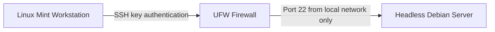

# VioletCipher Debian Homelab

A headless Debian Linux server built from repurposed hardware for hands-on practice with Linux administration, network security, SSH, firewalls, and remote server management.

## Project Overview

This project involved converting an older laptop into a dedicated Debian homelab server. The system is managed remotely from a Linux Mint workstation and secured using SSH key authentication and host-based firewall rules.

The goal was to gain practical experience installing, configuring, securing, and remotely administering a Linux server.

## Project Objectives

- Repurpose existing hardware as a Linux server
- Install Debian without a graphical desktop environment
- Configure secure remote administration
- Replace password-based SSH access with SSH keys
- Restrict inbound connections using UFW
- Practice Linux command-line and network administration
- Build a platform for future cybersecurity projects

## Network Architecture



## What I Implemented

### Debian Installation

- Created a bootable Debian installation USB
- Replaced the previous operating system
- Installed Debian without a desktop environment
- Installed OpenSSH Server and standard system utilities
- Configured the machine for headless operation

### Remote Administration

- Connected to the server remotely from Linux Mint
- Generated an SSH key pair protected by a passphrase
- Installed the public key on the server
- Verified key-based authentication before disabling passwords

### SSH Hardening

The OpenSSH server was configured with the following security controls:

```text
PermitRootLogin no
PasswordAuthentication no
KbdInteractiveAuthentication no
PubkeyAuthentication yes
```

SSH access was limited to an authorized administrative account.

### Firewall Configuration

UFW was installed and enabled to manage inbound connections.

SSH traffic was restricted to the local private network:

```text
ALLOW SSH FROM 10.0.0.0/24
```

Public-facing IP addresses and specific device addresses have been removed from this repository.

## Technologies Used

- Debian Linux
- OpenSSH
- UFW
- Bash
- SSH public-key authentication
- TCP/IP networking
- Rufus
- Linux Mint

## Verification

The following checks were performed:

- Confirmed remote SSH connectivity
- Confirmed SSH key authentication
- Confirmed password authentication was disabled
- Confirmed direct root login was disabled
- Confirmed UFW was active
- Confirmed SSH was restricted to the local network
- Confirmed remote shutdown and administration worked correctly

## Skills Demonstrated

- Linux installation and configuration
- Headless server administration
- SSH key management
- Firewall configuration
- Network access control
- Command-line troubleshooting
- Security hardening
- Technical documentation

## Documentation

Additional project documentation:

- [Debian Installation](docs/installation.md)
- [SSH Hardening](docs/ssh-hardening.md)
- [Firewall Configuration](docs/firewall-configuration.md)
- [Lessons Learned](docs/lessons-learned.md)

## Repository Structure

```text
debian-homelab-server/
├── README.md
├── docs/
│   ├── installation.md
│   ├── ssh-hardening.md
│   ├── firewall-configuration.md
│   └── lessons-learned.md
└── screenshots/
    ├── ssh-login.png
    └── ufw-status.png
```

## Future Improvements

- Assign a DHCP reservation to the server
- Configure automated security updates
- Add system monitoring
- Configure automated backups
- Deploy Docker containers
- Install a web server
- Create an isolated cybersecurity lab network
- Add centralized logging

## Security Notice

This repository documents an authorized personal homelab running on equipment and a network that I own.

Sensitive information has been removed, including:

- Public IP addresses
- Exact device addresses
- Passwords and passphrases
- SSH private keys
- MAC addresses
- Wireless network information
- Personally identifying account details
